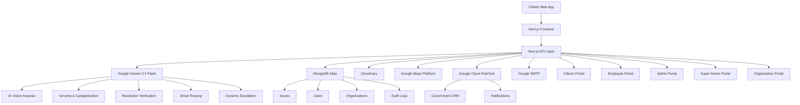

# Community Hero 

Community Hero is a next-generation civic issue reporting and community empowerment platform built with Next.js, Clerk Authentication, and advanced Google Gemini Vision AI.

The platform bridges the gap between citizens, city administrators, on-ground municipal employees, and volunteer organizations to rapidly solve hyperlocal problems.

---

## The Perfect System Architecture

The Community Hero system is built on a highly scalable, Every city operates as an isolated tenant with dedicated administrators, employees, organizations, analytics, and audit logs while sharing a common cloud infrastructure ,designed to handle thousands of concurrent users, complex AI vision processing, and secure civic data management.


### Technologies Used

**Frontend**
* Next.js 15 (App Router)
* React
* TypeScript
* Tailwind CSS
* Shadcn/UI & Framer Motion

Backend
- Node.js
- Next.js API Routes
- REST APIs

Database
- MongoDB Atlas
- Mongoose ODM
- Geospatial Indexing

Storage
- Cloudinary

**Responsive Experience**
The citizen portal is fully responsive and optimized for mobile phones, tablets, and desktops, allowing users to report, track, and review civic issues seamlessly from any device.

**Authentication & Security**
* Clerk Authentication (Role-Based Access Control - RBAC)
* Audit Logging
* SHA-256 Image Hashing & Image Compression

**AI & Agentic Intelligence(Google Gemini)**
* Google Gemini 2.5 Flash (Multimodal) via Google AI Studio
* Prompt Engineering & Structured JSON Generation
* Computer Vision & AI-assisted Decision Support
* **Adaptive SLA Monitoring & Dynamic Escalation (Agent Logic):** Continuously monitors progress and autonomously reassigns delayed cases to lower-workload employees, escalates to city administrators, or re-routes to volunteer groups using Google Gemini.
* **Self-Improving Routing Agent:** Continuously learns from past resolutions to automatically route new civic issues to the fastest-resolving departments/employees.
* **Vision Agent:** Image/video understanding, issue detection, and categorization.
* **Severity Agent:** Determines issue severity, generates reasoning, and assists in priority estimation.
* **Resolution Verification Agent:** Compares Before and After images to verify civic repairs and assist admin approval.
* **Content Generation:** Community impact summaries, volunteer appreciation messages, and smart recommendations.

**Maps & Location**
* Google Maps JavaScript API & Google Places API
* HTML5 Geolocation API
* GPS-based issue reporting, interactive maps, location validation, and community drive tracking.

**Other Integrations**
* Google SMTP (Nodemailer) for real-time notifications & certificates
* Puppeteer for headless PDF generation
* Google Cloud Pub/Sub for asynchronous event streaming

**Deployment**

* Google Cloud Run
* Google Cloud Build
* Google Secret Manager
* Google Cloud Logging
* Google Cloud Monitoring

##  End-to-End Workflows: A Five-Tier User Ecosystem

Community Hero features a strictly role-based architecture. Here is how the ecosystem interacts:

### 1. Citizen End (The Reporters)
* **Reporting:** Citizens can report issues (potholes, broken streetlights, illegal dumping) using the mobile-friendly web app.
* **GPS & Media:** They upload geo-verified images or videos along with live GPS coordinates.
* **Tracking:** They can track the exact status of their issue in real-time (from "Reported" to "Employee Reached Site" to "Awaiting Citizen Review").
* **Feedback:** Once a municipal worker completes the job, the citizen is notified and can give feedback/ratings.

### 2. Employee End (The Ground Workers)
* **Task Assignment:** Employees receive tickets assigned directly to them by City Admins.
* **On-Site Operations:** They log when they are "Travelling" and when they "Reached Site."
* **Material Requests:** If they need cement, asphalt, or wire, they can generate an in-app "Material Request" for admin approval.
* **Proof of Work:** They capture "After" photos and submit the work for AI verification before the ticket can be closed.

### 3. Admin End (City Administrators)
* **Dashboard:** Admins see a birds-eye view of their specific city. They have geospatial heatmaps and urgency dashboards.
* **Dispatching:** They review incoming issues, assign them to specific employees or departments, and approve material requests.
* **Verification:** After the **Gemini AI** automatically detects and verifies the "Before" and "After" proof photos, Admins review the AI's confidence score. Once the Admin confirms and clicks "Verify," the issue is officially marked as 100% complete (`Awaiting Citizen Review`).

### 4. Super Admin End (Global Overseers)
* **Oversight:** Super Admins have access to the entire country/state.
* **Personnel Management:** They can onboard new City Admins and officially verify trusted Volunteer Organizations.
* **Global Analytics:** They can generate detailed Monthly PDF Reports on civic performance, AI accuracy, and department efficiency across all regions.

### 5. Community Organizations & Drives (NGOs)
* **Organization Profile:** Registered NGOs and community groups get a dedicated profile and a dynamic **Trust Score** (0-100) based on their track record.
* **Organizing Drives:** Verified organizations can create "Volunteer Drives" (e.g., Beach Cleanup, Tree Plantation).
* **Recruitment:** Citizens can browse the "Community" tab and RSVP to these drives.
* **Automated Certification:** Upon drive completion, the organization marks the attendance. The system automatically renders official PDF Certificates via Puppeteer and emails them directly to the volunteers using **Google SMTP**.

---

## Enterprise AI Architecture (Google Gemini)

Unlike standard projects that rely on simple "magic prompts," Community Hero utilizes a production-grade ML architecture designed for 99%+ reliability and strict deterministic outputs.

### Explainable AI
Every prediction returned by Gemini includes structured reasoning so administrators understand why the recommendation was generated before taking action.

### 1. Gemini: Severity & Categorization Analysis
When a citizen uploads an image, the Gemini Vision model is invoked with strict Native JSON Schema Validation.
* **Chain of Thought (CoT):** The schema forces the model to generate a `detailedVisualAnalysis` string *before* outputting the `category`. By forcing it to "think" and describe textures/anomalies first, classification accuracy skyrockets.
* **Zero-Temperature Execution:** We explicitly set `temperature: 0.0`. This makes the model completely rigid, analytical, and deterministic. It stops trying to be "creative" and strictly pattern-matches the civic issues.
* **Scoring:** It accurately generates a `severity` label (Low, Medium, High, Emergency) and an `urgencyScore` to help admins triage immediately.

### 2. Gemini: Before & After Proof Verification
When an employee claims they have fixed an issue, they upload a resolution photo.
* **Visual Diffing:** The Gemini Vision model takes *both* the original Citizen's photo (Before) and the Employee's photo (After).
* **Contextual Analysis:** It analyzes if the specific damage (e.g., a pothole) in the exact same environment has actually been repaired. 
* **Confidence Rating:** It outputs an `isResolved` boolean and a `confidence` percentage, allowing admins to instantly reject fake or poor-quality repairs without having to visit the site themselves.
### 3. Human-in-the-Loop AI
AI assists administrators rather than replacing them. Every recommendation remains subject to human approval.

---

##  Production-Ready Bilingual Translation (English & हिन्दी)

To promote inclusivity, the Citizen Panel includes full support for both English and Hindi.
- **Instant Non-Refreshed Language Toggles**: Integrated a dynamic switcher inside the navbar allowing citizens to translate the platform instantly. Language choices persist across refreshes using `localStorage`.
- **Bilingual AI Processing**: The backend Gemini analysis pipelines parse the active locale parameter. If Hindi is active, Gemini generates visual reasoning descriptions and severity reasons in Hindi.
- **Dynamic Translation Normalization**: To prevent database corruption and preserve filtering on employee and admin dashboards, all issues, statuses, and departments are saved using standard English keys. The frontend dynamically translates them on-the-fly when Hindi is active.

---
Agent	             | Responsibility
Vision Agent       |	Detects issue category
Severity Agent     | Predicts urgency
Routing Agent      |	Assigns department
Escalation Agent   |	Monitors SLA
Verification Agent | Compares before/after

##  Getting Started

1. Clone the repository.
2. Install dependencies:
   ```bash
   npm install
   ```
3. Set up your `.env.local` file with your Clerk, MongoDB, and Gemini API keys:
   ```env
   NEXT_PUBLIC_CLERK_PUBLISHABLE_KEY=pk_test_...
   CLERK_SECRET_KEY=sk_test_...
   GEMINI_API_KEY=AIza...
   MONGODB_URI=mongodb+srv://...
   ```
4. Run the development server:
   ```bash
   npm run dev
   ```

Open [http://localhost:3000](http://localhost:3000) with your browser to see the platform in action.

##  Community Hero

Community Hero transforms fragmented civic services into an AI-powered, transparent, multilingual, and community-driven governance platform where every complaint is trackable, every AI recommendation is explainable, and every resolution is verifiable.